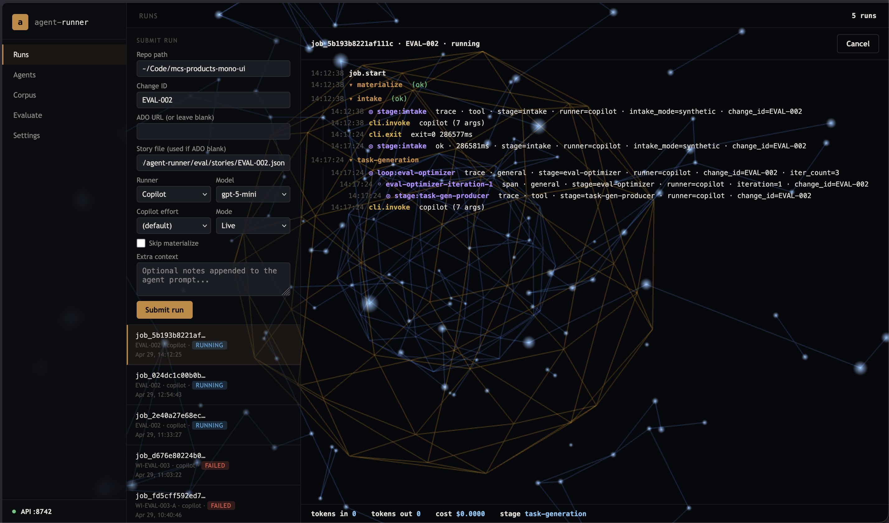
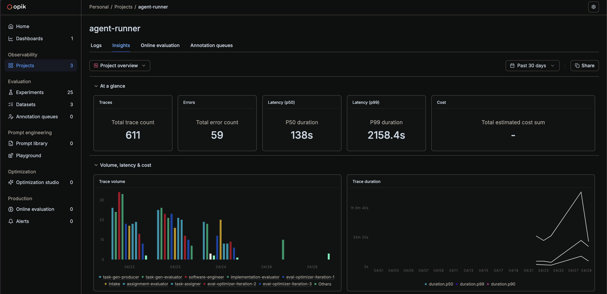

# agent-workbench

**Agent Workbench is a local mission-control UI for AI-assisted software delivery.** It turns a synthetic story or Azure DevOps work item into a traceable multi-agent workflow you can launch, monitor, inspect, and evaluate locally.

The current runner executes a six-stage workflow:

```text
intake → task generation → task assignment → implementation ⟳ QA → lessons
                                                    ↑ evaluator feedback |
```

Implementation and QA use evaluator/optimizer loops. A producer agent writes an artifact, an evaluator scores it, and evaluator feedback is injected into the next iteration unless the evaluator returns `PASS`.

| Local Agent Workbench UI | Opik observability command center |
|---|---|
|  |  |

> The repo is named `agent-workbench`, while some runtime paths and UI labels still use the older `agent-runner` name, such as `~/.agent-runner/` and the browser title.

## What this repository gives you

| Capability | What it means |
|---|---|
| **Browser UI for workflow runs** | Submit runs, choose a runner/model, watch live events, cancel jobs, respond to clarification prompts, and inspect history at `http://127.0.0.1:8742`. |
| **Synthetic + ADO intake** | Work offline with local JSON fixtures, or point the same workflow at a live Azure DevOps work item. |
| **Traceable artifacts** | Every run writes canonical artifacts under `agent-context/<change-id>/`. |
| **Opik integration** | Bootstrap can start a local Opik stack and the UI can deep-link runs and evaluation views into Opik. |
| **Evaluation framework** | `eval/synthesize.py` generates predicted easy/medium/hard stories by default, and `eval/run_eval.py` runs suites with scoring and baseline comparison. |
| **Hermetic recordings** | Server-launched runs can record subprocess I/O into local cassettes. |

## Quick start

### Prerequisites

| Dependency | Required for | Notes |
|---|---|---|
| Python 3.9+ | `run.py`, `server_main.py`, bootstrap, eval tools | Bootstrap creates `.venv/`, but does not install Python. |
| `git` | bootstrap and normal repo workflows | Used for the repo itself and for syncing the local Opik checkout. |
| Docker Desktop | bundled local Opik stack | Required only when you want bootstrap to start self-hosted Opik. |
| One AI backend CLI | actual workflow execution | Install and authenticate at least one of `claude`, `copilot`, or `gemini`. |
| Azure CLI + `azure-devops` extension | live ADO intake mode | Not required for local synthetic stories. |

### Optional tooling

| Dependency | What it does |
|---|---|
| `rtk` | When `rtk` is available on `PATH`, the workflow routes terminal work through RTK-aware tooling to reduce noisy command output. Falls back to normal execution when absent. Install from the internal [mayo-rtk-ai](https://dev.azure.com/mclm/Mayo%20Open%20Developer%20Network/_git/mayo-rtk-ai) repo — see `requirements.txt` for instructions. |

### Fastest local setup on macOS

```bash
./bootstrap.sh
```

That flow:

- creates or reuses `.venv/`
- installs `requirements.txt`
- materializes agents, skills, and helper scripts
- clones or updates a local Opik checkout under `~/.agent-runner/opik`
- starts the local Opik stack
- persists Opik metadata into `~/.agent-runner/config.json`
- starts the local API + GUI on `http://127.0.0.1:8742`

### Manual server startup

Use this when you want the app without running the full bootstrap flow.

```bash
python3 -m pip install -r requirements.txt
python3 server_main.py
python3 server_main.py --log-level info
```

Development reload:

```bash
python3 server_main.py --reload
```

Custom bind host/port:

```bash
python3 server_main.py --host 127.0.0.1 --port 8742
```

## Run your first workflow

### From the browser

Open `http://127.0.0.1:8742`, fill in the **Runs** form, and submit a job. The UI exposes:

- repo path
- change ID
- optional Azure DevOps work item URL
- runner + model
- mode (`live` or `hermetic`)
- extra context appended to intake

When a run is selected and Opik is configured, **Open current run in Opik** opens a filtered trace view for that run's `change_id` / thread ID.

### From the CLI

Run with the bundled synthetic fixture:

```bash
python3 run.py --repo /absolute/path/to/target/repo
```

Run with an explicit fixture:

```bash
python3 run.py \
  --repo /absolute/path/to/target/repo \
  --story-file /absolute/path/to/agent-workbench/workflow-fixtures/synthetic_story.json
```

Run against Azure DevOps:

```bash
python3 run.py \
  --repo /absolute/path/to/target/repo \
  --ado-url 'https://dev.azure.com/<org>/<project>/_workitems/edit/123456'
```

Choose a runner explicitly:

```bash
python3 run.py --repo /absolute/path/to/target/repo --runner claude
python3 run.py --repo /absolute/path/to/target/repo --runner copilot
python3 run.py --repo /absolute/path/to/target/repo --runner gemini
python3 run.py --repo /absolute/path/to/target/repo --log-level debug
```

Current built-in default models are:

- `claude` → `claude-haiku-4-5-20251001`
- `copilot` → `gpt-5-mini`
- `gemini` → `gemini-2.5-flash`

Pass extra context into intake:

```bash
python3 run.py \
  --repo /absolute/path/to/target/repo \
  --ado-url 'https://dev.azure.com/<org>/<project>/_workitems/edit/123456' \
  --extra-context 'Reference PR: https://dev.azure.com/<org>/<project>/_git/<repo>/pullrequest/456'
```

Useful workflow flags:

| Flag | Purpose |
|---|---|
| `--story-file` | Use a local synthetic fixture JSON file |
| `--ado-url` | Use a live Azure DevOps work item |
| `--change-id` | Override or supply the workflow change ID |
| `--runner` / `--model` | Select runner/model or runner alias |
| `--log-level` | Set CLI logging verbosity (`debug`, `info`, `warning`, `error`, `critical`) |
| `--extra-context` | Append free-form context to intake |
| `--skip-lessons-optimizer` | Skip the final lessons stage |
| `--calibration-fast-mode` | Use a cheaper single-iteration workflow profile for calibration-style runs |

## Evaluation framework

The evaluation framework lives under [`eval/`](eval/).

- `eval/synthesize.py` generates repository-wide easy/medium/hard stories
- default synthesis produces **predicted tiers** only
- empirical calibration is **opt-in** with `--calibrate`
- `eval/run_eval.py` runs suites or individual stories against a target repo

Quick example:

```bash
python3 eval/synthesize.py \
  --dataset eval/datasets/my-service.yaml \
  --runner copilot \
  --output eval/suites \
  --stories-output eval/stories

python3 eval/run_eval.py \
  --suite eval/suites/hard \
  --repo /absolute/path/to/target/repo \
  --skip-opik
```

For the full evaluation workflow, artifacts, source types, calibration, plugins, baselines, and troubleshooting, see [`eval/README.md`](eval/README.md).

## Local API + GUI

The FastAPI server serves the GUI at `/` and exposes JSON and SSE endpoints for automation.

### UI views

The current UI includes five views:

- **Runs**
- **Agents**
- **Evaluations**
- **Evaluate**
- **Settings**

### Local state

```text
~/.agent-runner/
├── config.json
├── jobs.db
├── cassettes/<change-id>.jsonl
├── memory/
└── opik/
```

Server event logs are written in the repo under:

```text
logs/<change-id>/events.jsonl
```

### Hermetic mode

Submitting a run in **Hermetic** mode records subprocess invocations into `~/.agent-runner/cassettes/{change_id}.jsonl`. The workflow still talks to the real backend CLI; this mode captures I/O, it does not replay it.

### API endpoints

| Method | Path | Notes |
|---|---|---|
| `GET` | `/health` | Liveness + version |
| `GET` | `/` | Serves the GUI |
| `POST` | `/runs` | Submit a regular workflow run |
| `GET` | `/runs` | List regular runs by default; pass `run_kind=evaluation` or `all` to widen scope |
| `GET` | `/runs/{job_id}` | Job detail, children, and Opik link context |
| `GET` | `/runs/{job_id}/events` | Replay the full event log as JSON |
| `GET` | `/runs/{job_id}/stream` | SSE stream with `Last-Event-ID` / `?after=` support |
| `POST` | `/runs/{job_id}/respond` | Submit answers when a run is waiting for user input |
| `POST` | `/runs/{job_id}/cancel` | Cancel a queued or running job |
| `GET` | `/agents` | List materialized agents |
| `GET` | `/agents/{name}` | Read the latest prompt + metadata for one agent |
| `GET` | `/corpus` | List evaluation stories |
| `GET` | `/corpus/{change_id}` | Read one evaluation story |
| `GET` | `/evaluate/summary` | Aggregate evaluation summary |
| `POST` | `/evaluate/runs` | Start an evaluation run |
| `GET` / `PUT` | `/settings` | Read/update `~/.agent-runner/config.json` |
| `POST` | `/settings/opik/connect` | Resolve and save Opik workspace/project metadata |

Example run submission:

```bash
curl -X POST http://127.0.0.1:8742/runs \
  -H 'content-type: application/json' \
  -d '{
    "repo": "/absolute/path/to/target/repo",
    "change_id": "TEST-AC-001",
    "story_file": "/absolute/path/to/agent-workbench/workflow-fixtures/synthetic_story.json",
    "runner": "claude",
    "mode": "live"
  }'
```

## Synthetic mode vs. ADO mode

| | Synthetic | ADO |
|---|---|---|
| Credentials needed | None | Azure CLI |
| Network required | No | Yes |
| Input source | Local JSON fixture | Live Azure DevOps work item |
| Selected by | `--story-file` or default fixture | `--ado-url` |

## Synthetic fixture format

Synthetic fixtures must be JSON objects with these required fields:

| Field | Type | Notes |
|---|---|---|
| `change_id` | string | May also be supplied via `--change-id` |
| `title` | string | One-line title |
| `description` | string | Narrative description |
| `acceptance_criteria` | list or object | Must be non-empty |

Acceptance criteria can be either:

```json
{ "acceptance_criteria": ["First criterion", "Second criterion"] }
```

or:

```json
{ "acceptance_criteria": { "AC1": "First criterion", "AC2": "Second criterion" } }
```

Bundled fixture:

| File | Change ID | Purpose |
|---|---|---|
| `workflow-fixtures/synthetic_story.json` | `TEST-AC-001` | Default smoke-test fixture used when neither `--story-file` nor `--ado-url` is provided |

## Artifact layout

```text
agent-context/<change-id>/
├── intake/
│   ├── story.yaml
│   ├── config.yaml
│   ├── constraints.md
│   ├── user_questions.json      # when the workflow asks for user input
│   └── user_responses.json      # written after /runs/{job_id}/respond
├── planning/
│   ├── tasks.yaml
│   └── assignments.json
├── execution/
│   └── <uow-id>/
│       └── impl_report.yaml
├── qa/
│   └── qa_report.yaml
└── summary/
    ├── lessons_optimizer_report.yaml
    └── workflow_status.yaml

logs/<change-id>/
└── events.jsonl
```

## Workflow stages

1. **Intake** — normalizes fixture or ADO input into canonical intake artifacts
2. **Task Generation** — writes `planning/tasks.yaml`
3. **Task Assignment** — writes `planning/assignments.json`
4. **Implementation** — iterates through units of work and writes per-UoW implementation reports
5. **QA** — validates the implementation and writes `qa/qa_report.yaml`
6. **Lessons** — writes `summary/lessons_optimizer_report.yaml`

When runs are launched through the local API, the server also records structured events in `logs/<change-id>/events.jsonl` and streams them over SSE.

## Testing

```bash
python3 -m pytest -q tests/test_server_routes.py tests/test_server_events.py
python3 -m pytest -q tests/test_workflow_inputs.py tests/test_runner_proc.py
python3 -m pytest -q tests/test_eval_run_eval.py tests/test_eval_synthesize.py
python3 -m pytest -q tests/
```

## Troubleshooting

| Error | Cause | Fix |
|---|---|---|
| `Synthetic story fixture not found` | Bad `--story-file` path | Use an absolute path or `~` expansion |
| `Synthetic story fixture must be a JSON object` | Top-level JSON is not an object | Wrap the fixture in `{}` |
| `missing required field(s)` | `title`, `description`, or `acceptance_criteria` missing or empty | Add the missing required fields |
| `acceptance_criteria must be ...` | Empty / invalid AC values | Use a non-empty list of strings or non-empty string map |
| `change_id does not match` | `--change-id` and fixture `change_id` conflict | Remove one or make them match |
| `Provide either ado_url or story_file, not both` | Both modes were requested | Pick one intake mode |
| `api.port must be an integer between 1 and 65535` | Invalid settings value or bad `--port` override | Choose a valid TCP port |
| Browser shows `API offline` | `server_main.py` is not running or host/port changed | Start the server and open the configured host/port |

## Synthetic mode markers

After intake, synthetic runs are identifiable by:

- `intake/story.yaml` with synthetic raw input metadata
- `intake/config.yaml` marking the run as synthetic-fixture based
- the absence of ADO provenance metadata
