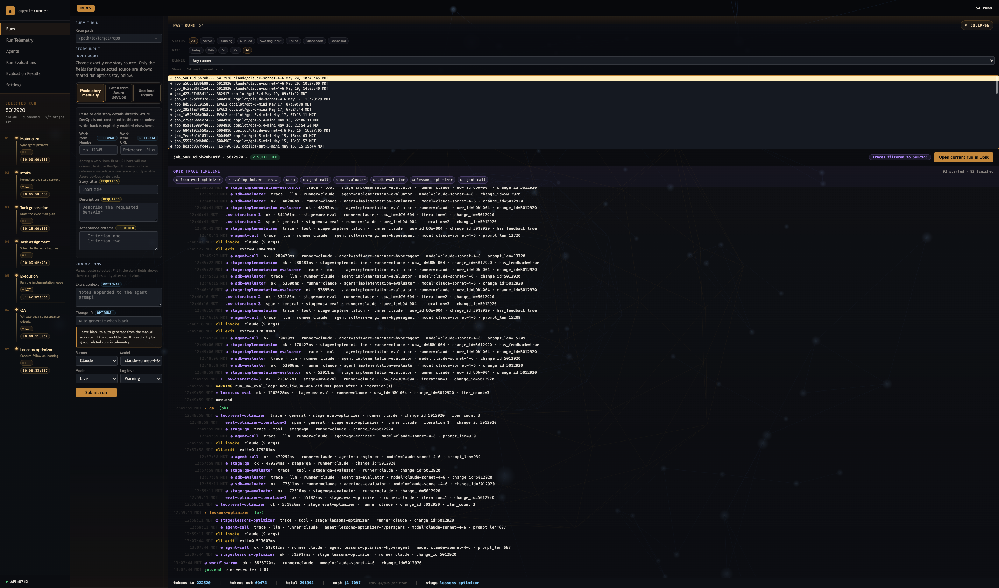
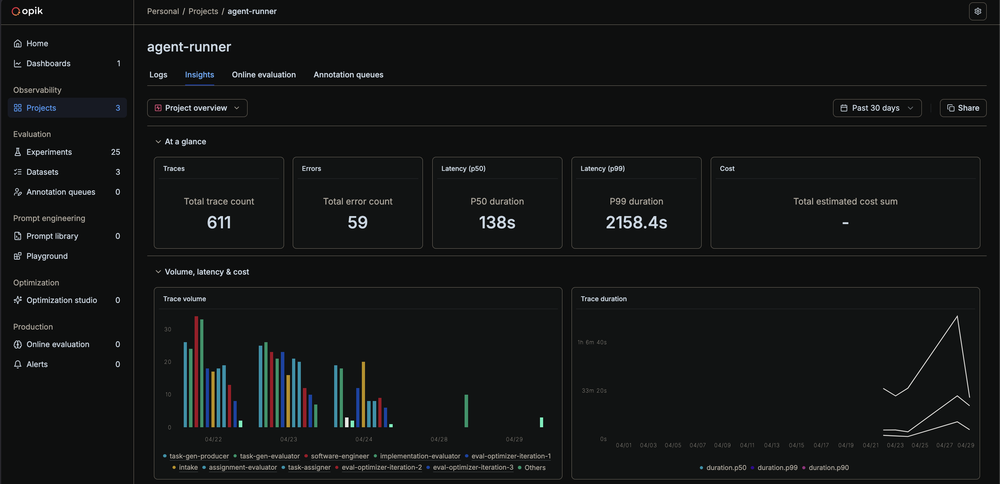

# agent-workbench

**Agent Workbench is a local UI for AI-assisted software delivery.** It turns a manually pasted story, a local synthetic story fixture, or an Azure DevOps work item into a traceable multi-agent workflow you can launch, monitor, inspect, and evaluate locally.

The current runner executes a six-stage workflow:

```text
intake → task generation → task assignment → implementation ⟳ QA → lessons
                                                    ↑ evaluator feedback |
```

Implementation and QA use evaluator/optimizer loops. A producer agent writes an artifact, an evaluator scores it, and evaluator feedback is injected into the next iteration unless the evaluator returns `PASS`.

| Local Agent Workbench UI | Opik observability command center |
|---|---|
|  |  |

> The repo is named `agent-workbench`, while some runtime paths and UI labels still use the older `agent-runner` name, such as `~/.agent-runner/` and the browser title.

## What this repository gives you

| Capability | What it means |
|---|---|
| **Browser UI for workflow runs** | Submit runs, choose a runner/model, watch live events, cancel jobs, respond to clarification prompts, and inspect history at `http://127.0.0.1:8742`. |
| **Manual-first story intake** | Paste a story manually by default, use local JSON fixtures for offline testing, or optionally point the same workflow at a live Azure DevOps work item. |
| **Traceable artifacts** | Every run writes canonical artifacts under `agent-context/<change-id>/`. |
| **Opik integration** | Bootstrap can start a local Opik stack and the UI can deep-link runs and evaluation views into Opik. |
| **Evaluation framework** | `eval/runner.py` runs the official hidden-test benchmarks with AC-level scoring, repeated trials, baseline comparison, and structured reports. |
| **Hermetic recordings** | Server-launched runs can record subprocess I/O into local cassettes. |

## Future planned features

The current platform is intentionally local-first and workflow-centric. The next wave of work is aimed at tightening the review loop, improving operator ergonomics, and making agent runs easier to supervise in real time.

- **Pull request automation**
  - add a dedicated PR agent
  - create a PR automatically after code is pushed
  - trigger PR review agents as part of the workflow
  - keep the review loop running until critical PR feedback is resolved
  - add Veracode scanning directly into the workflow
- **Smarter workflow orchestration**
  - enrich acceptance criteria earlier by interrogating ambiguities before execution starts
  - update the harness so agents explicitly escalate to the user when they hit blocking questions or decisions
  - add a chat-style escalation surface so agents can raise issues to the user in context
  - explore bounded evaluator loops, including configurable max-retry behavior for eval passes
- **GUI and operator experience**
  - persist recently used repo paths and surface them at the top of the repo dropdown (most recent first)
  - fix the small-screen Agent Workbench UI bug
  - cap or virtualize rendered log output so the live GUI is less expensive on laptops
  - show remaining user budget directly in the interface
  - support lightweight notes and tags for runs and artifacts
- **Search and integrations**
  - improve informational search relevance using richer post-detail context
  - integrate with Discord

## Quick start

### Prerequisites

| Dependency | Required | Required for | Notes |
|---|----------|---|---|
| Python 3.9+ | Yes      | `run.py`, `server_main.py`, bootstrap, eval tools | Bootstrap creates `.venv/`, but does not install Python. |
| `git` | Yes      | bootstrap and normal repo workflows | Used for the repo itself and for syncing the local Opik checkout. |
| Docker Desktop | No       | bundled local Opik stack | Required only if you opt in to the bundled local Opik stack at bootstrap time (the bootstrap script will prompt you). Skip-able by default or via `--no-opik`. |
| One AI backend CLI | Yes      | actual workflow execution | Install and authenticate at least one of `claude`, `codex`, `copilot`, or `gemini`. |
| Azure CLI + `azure-devops` extension | No       | optional live ADO intake mode | Manual story entry and local synthetic stories do not require Azure DevOps tooling. |

### Optional tooling

| Dependency | Required | What it does |
|---|---|---|
| `rtk` | No | When `rtk` is available on `PATH`, the workflow routes terminal work through RTK-aware tooling to reduce token usage. Falls back to normal execution when absent. `rtk` means “rust token killer.” Install from the internal [mayo-rtk-ai](https://dev.azure.com/mclm/Mayo%20Open%20Developer%20Network/_git/mayo-rtk-ai) repo — see `requirements.txt` for instructions. |

### Fastest local setup on macOS / Linux

```bash
./bootstrap.sh
```

### Fastest local setup on Windows

Open a PowerShell terminal and run:

```powershell
.\bootstrap.ps1
```

That flow:

- creates or reuses `.venv/`
- installs `requirements.txt`
- leaves generated runner assets untouched by default; use `--materialize` or `python3 core/materialize.py` when you explicitly choose to refresh agents, skills, and helper scripts
- keeps manual story entry available by default; Azure DevOps integration can be enabled later in Settings if you install/configure it
- prompts you (y/N) whether to enable the bundled local [Opik](https://github.com/comet-ml/opik/blob/main/README.md) observability stack — answer "n" (default) to skip Docker entirely
- if enabled: clones / updates `~/.agent-runner/opik`, starts the stack, persists Opik metadata into `~/.agent-runner/config.json`
- starts the local API + GUI on `http://127.0.0.1:8742`

Skip the prompt non-interactively with `--with-opik` or `--no-opik`. Enabling Opik requires Docker Desktop to be running.
If Opik is skipped, not configured, or temporarily unreachable, workflow runs continue without Opik tracing.

### Bootstrap CLI reference

| Flag | Default | Description |
|------|---------|-------------|
| `--host` | `127.0.0.1` | Server bind host. |
| `--port` | `8742` | Server bind port. |
| `--reload` | off | Start the FastAPI server with `--reload` for development. |
| `--with-opik` | — | Enable the bundled local Opik stack (requires Docker). Skips the interactive prompt. |
| `--no-opik` | — | Skip the bundled local Opik stack. Skips the interactive prompt. |
| `--eval-target-repo` | — | Target repo path or Git URL used for generated workflow eval benchmarks. |
| `--materialize` | off | Explicitly refresh generated runner assets during bootstrap. Off by default so prompt-file changes remain manual. |
| `--eval-target-sha` | — | Gold-master commit SHA for generated workflow eval benchmarks. |
| `--generate-eval-benchmarks` | off | Use an LLM to generate `eval/benchmarks/{easy,medium,hard}` during bootstrap. |
| `--skip-eval-benchmarks` | off | Do not prompt for or generate eval benchmarks during bootstrap. |
| `--eval-runner` | configured runner | LLM CLI for benchmark generation: `claude`, `codex`, `copilot`, `copilot-*` alias, `gemini`, or `openai-compat`. Can also be set via `EVAL_RUNNER` env var. |
| `--eval-model` | runner default | Optional model override for benchmark generation. Can also be set via `EVAL_MODEL` env var. Valid values depend on the runner — see `core/runner_models.py`. |
| `--force-eval-benchmarks` | off | Overwrite existing generated benchmark folders instead of skipping them. |
| `--no-verify-eval-gold-fails` | off | Skip running generated hidden tests against the gold-master during benchmark generation. Intended for local debugging only. |

### Manual server startup

Use this when you want the app without running the full bootstrap flow.

```bash
python3 -m pip install -r requirements.txt
python3 server_main.py
python3 server_main.py --log-level info
```

Development reload:

```bash
python3 server_main.py --reload
```

Custom bind host/port:

```bash
python3 server_main.py --host 127.0.0.1 --port 8742
```

## Run your first workflow

### From the browser

Open `http://127.0.0.1:8742`, fill in the **Runs** form, and submit a job. Manual story entry is the default path; Azure DevOps is optional. The UI exposes:

- repo path
- story source selection (`Paste story manually`, `Fetch from Azure DevOps`, `Use local fixture`)
- pasted story title, description, acceptance criteria, and optional reference-only work item metadata
- optional change ID
- runner + model
- mode (`live` or `hermetic`)
- extra context appended to intake

When a run is selected and Opik is configured, **Open current run in Opik** opens a filtered trace view for that run's `change_id` / thread ID.

### From the CLI

Run with the bundled synthetic fixture:

```bash
python3 run.py --repo /absolute/path/to/target/repo
```

Run with an explicit fixture:

```bash
python3 run.py \
  --repo /absolute/path/to/target/repo \
  --story-file /absolute/path/to/agent-workbench/workflow-fixtures/synthetic_story.json
```

Run against Azure DevOps:

```bash
python3 run.py \
  --repo /absolute/path/to/target/repo \
  --ado-url 'https://dev.azure.com/<org>/<project>/_workitems/edit/123456'
```

Run with a manual story file:

```bash
python3 run.py \
  --repo /absolute/path/to/target/repo \
  --manual-story-file /absolute/path/to/manual_story.json
```

Choose a runner explicitly:

```bash
python3 run.py --repo /absolute/path/to/target/repo --runner claude
python3 run.py --repo /absolute/path/to/target/repo --runner codex
python3 run.py --repo /absolute/path/to/target/repo --runner copilot
python3 run.py --repo /absolute/path/to/target/repo --runner gemini
python3 run.py --repo /absolute/path/to/target/repo --log-level debug
```

Current built-in default models are:

- `claude` → `claude-haiku-4-5-20251001`
- `codex` → `gpt-5.2-codex` (any model name accepted; presets are suggestions only)
- `copilot` → `gpt-5-mini`
- `gemini` → `gemini-2.5-flash`
- `openai-compat` → `deepseek-v4-pro:cloud` (any model name accepted; presets are suggestions only)

Want to create a custom alias for a local or third-party LLM endpoint (for example, LM Studio, OpenRouter, or a LiteLLM proxy)? See [`docs/openai-compat-setup.md`](docs/openai-compat-setup.md).

Pass extra context into intake:

```bash
python3 run.py \
  --repo /absolute/path/to/target/repo \
  --ado-url 'https://dev.azure.com/<org>/<project>/_workitems/edit/123456' \
  --extra-context 'Reference PR: https://dev.azure.com/<org>/<project>/_git/<repo>/pullrequest/456'
```

### `run.py` — all CLI arguments

| Argument | Default | Description |
|---|---|---|
| `--repo PATH` | current working directory | Absolute path to the target repository the workflow will operate on. |
| `--change-id ID` | derived from input | Stable identifier for this workflow run. Derived automatically from the story fixture or ADO item when omitted; only required when you need to override the value embedded in the input. |
| `--ado-url URL` | none | Azure DevOps work item URL (`https://dev.azure.com/<org>/<project>/_workitems/edit/<id>`). Triggers live ADO intake mode. Mutually exclusive with `--story-file` and `--manual-story-file`. |
| `--story-file PATH` | `workflow-fixtures/synthetic_story.json` | Path to a local synthetic story fixture JSON file. Used for offline / test runs. Falls back to the bundled `TEST-AC-001` fixture when no explicit story source is provided. |
| `--manual-story-file PATH` | none | Path to a JSON file containing manually pasted story fields (`title`, `description`, `acceptance_criteria`, optional work item reference fields, optional extra context). Treats work item IDs and URLs as reference-only metadata unless explicit write-back is enabled later. |
| `--runner NAME` | `claude` | LLM backend to use: `claude` (Anthropic), `codex` (OpenAI Codex CLI), `copilot` (OpenAI/GitHub), `gemini` (Google), `openai-compat` (any OpenAI-compatible endpoint), or a custom alias defined in `~/.agent-runner/config.json` under `runner_aliases`. |
| `--model NAME` | runner default | Model name to pass to the selected runner. Defaults to the runner's built-in default when omitted. For `codex` and `openai-compat`, any model name is accepted; `claude`/`copilot`/`gemini` require a known model from their allowlists. |
| `--extra-context TEXT` | none | Free-form text appended verbatim to the intake agent's prompt. Useful for passing a reference PR URL, design notes, or other supplemental context. |
| `--skip-lessons-optimizer` | always on | Deprecated compatibility flag. The lessons optimizer is disabled and is never invoked. |
| `--materialize` | off | Explicitly copy enabled agent/skill/script source files into runner-specific generated directories before the workflow starts. |
| `--skip-materialize` | on | Do not refresh generated runner assets. This is the default so prompt-file changes remain manual. |
| `--calibration-fast-mode` | off | Use a cheaper single-iteration profile for every evaluator/optimizer loop. Intended for synthesis calibration runs where full loop quality is not required. |
| `--headless` | off | Disable interactive human-in-the-loop prompts. Escalation requests from agents are auto-answered. Required for CI/eval environments. |
| `--log-level LEVEL` | `warning` | Python logging verbosity: `debug`, `info`, `warning`, `error`, or `critical`. |

## Evaluation framework

The evaluation framework lives under [`eval/`](eval/) and is centered on the
official hidden-test benchmark harness:

- `eval/benchmarks/<difficulty>/story.json` defines each benchmark work item
- `eval/benchmarks/<difficulty>/hidden_tests.py` defines AC-mapped pytest checks
- `eval/runner.py` runs benchmarks against a target repo, parses hidden-test JUnit
  output, reports AC-level quality, supports repeated trials, and compares to an
  optional baseline report
- `eval/seed_benchmarks.py` can generate or repair benchmark fixtures

Quick example:

```bash
python3 eval/runner.py \
  --repo /absolute/path/to/target/repo \
  --sha <gold-master-commit-sha> \
  --difficulty easy medium hard \
  --runs 3 \
  --compare-to eval/reports/baseline.json
```

For the full evaluation workflow, artifacts, source types, calibration, plugins, baselines, and troubleshooting, see [`eval/README.md`](eval/README.md).

## Local API + GUI

The FastAPI server serves the GUI at `/` and exposes JSON and SSE endpoints for automation.

### UI views

The current UI includes five views:

- **Runs**
- **Agents**
- **Evaluations**
- **Evaluate**
- **Settings**

### Local state

```text
~/.agent-runner/
├── config.json
├── jobs.db
├── cassettes/<change-id>.jsonl
├── memory/
└── opik/        # only present when Opik is enabled at bootstrap (--with-opik)
```

Server event logs are written in the repo under:

```text
logs/<change-id>/events.jsonl
```

### Hermetic mode

Submitting a run in **Hermetic** mode records subprocess invocations into `~/.agent-runner/cassettes/{change_id}.jsonl`. The workflow still talks to the real backend CLI; this mode captures I/O, it does not replay it.

### API endpoints

| Method | Path | Notes |
|---|---|---|
| `GET` | `/health` | Liveness + version |
| `GET` | `/` | Serves the GUI |
| `POST` | `/runs` | Submit a regular workflow run |
| `GET` | `/runs` | List regular runs by default; pass `run_kind=evaluation` or `all` to widen scope |
| `GET` | `/runs/{job_id}` | Job detail, children, and Opik link context |
| `GET` | `/runs/{job_id}/events` | Replay the full event log as JSON |
| `GET` | `/runs/{job_id}/stream` | SSE stream with `Last-Event-ID` / `?after=` support |
| `POST` | `/runs/{job_id}/respond` | Submit answers when a run is waiting for user input |
| `POST` | `/runs/{job_id}/cancel` | Cancel a queued or running job |
| `GET` | `/agents` | List enabled agent definitions |
| `GET` | `/agents/{name}` | Read the latest prompt + metadata for one agent |
| `GET` | `/corpus` | List generated story corpus entries |
| `GET` | `/corpus/{change_id}` | Read one generated story corpus entry |
| `GET` | `/evaluate/summary` | Read the latest benchmark-report summary from `eval/reports` |
| `GET` | `/evaluate/reports` | List benchmark reports available for comparison |
| `POST` | `/evaluate/benchmark-runs` | Start a hidden-test benchmark run through `eval/runner.py` |
| `GET` / `PUT` | `/settings` | Read/update `~/.agent-runner/config.json` |
| `POST` | `/settings/opik/connect` | Resolve and save Opik workspace/project metadata |

Example run submission:

```bash
curl -X POST http://127.0.0.1:8742/runs \
  -H 'content-type: application/json' \
  -d '{
    "repo": "/absolute/path/to/target/repo",
    "change_id": "TEST-AC-001",
    "story_file": "/absolute/path/to/agent-workbench/workflow-fixtures/synthetic_story.json",
    "runner": "claude",
    "mode": "live"
  }'
```

## Story input modes

| | Manual | Synthetic | ADO |
|---|---|---|---|
| Credentials needed | None | None | Azure CLI |
| Network required | No | No | Yes |
| Input source | Pasted/manual story JSON | Local JSON fixture | Live Azure DevOps work item |
| Selected by | Runs UI default or `--manual-story-file` | `--story-file` or default fixture | `--ado-url` |

## Synthetic fixture format

Synthetic fixtures must be JSON objects with these required fields:

| Field | Type | Notes |
|---|---|---|
| `change_id` | string | May also be supplied via `--change-id` |
| `title` | string | One-line title |
| `description` | string | Narrative description |
| `acceptance_criteria` | list or object | Must be non-empty |

Acceptance criteria can be either:

```json
{ "acceptance_criteria": ["First criterion", "Second criterion"] }
```

or:

```json
{ "acceptance_criteria": { "AC1": "First criterion", "AC2": "Second criterion" } }
```

Bundled fixture:

| File | Change ID | Purpose |
|---|---|---|
| `workflow-fixtures/synthetic_story.json` | `TEST-AC-001` | Default smoke-test fixture used when neither `--story-file` nor `--ado-url` is provided |

## Manual story file format

Manual story files are JSON objects with these required fields:

| Field | Type | Notes |
|---|---|---|
| `title` | string | One-line title |
| `description` | string | Narrative description |
| `acceptance_criteria` | string, list, or object | Must contain at least one non-empty item; free-form text is normalized into `AC1`, `AC2`, ... |
| `work_item_id` | string | Optional reference-only metadata |
| `work_item_url` | string | Optional reference-only metadata |
| `extra_context` | string | Optional extra notes preserved in intake |

## Artifact layout

```text
agent-context/<change-id>/
├── intake/
│   ├── story.yaml
│   ├── config.yaml
│   ├── constraints.md
│   ├── user_questions.json      # when the workflow asks for user input
│   └── user_responses.json      # written after /runs/{job_id}/respond
├── planning/
│   ├── tasks.yaml
│   └── assignments.json
├── execution/
│   └── <uow-id>/
│       ├── impl_report.yaml
│       ├── impl_report_validation.yaml
│       └── attempts/
│           └── attempt-001/
│               └── impl_report.yaml
├── qa/
│   ├── qa_report.yaml
│   └── evidence/
│       ├── logs/
│       ├── screenshots/
│       └── test_output/
└── summary/
    ├── workflow_status.yaml
    ├── run_metrics.yaml
    └── events.jsonl              # copy of logs/<change-id>/events.jsonl when present

logs/<change-id>/
├── events.jsonl
└── <agent>/
    └── *_session.json            # server-driven CLI invocation summaries
```

## Workflow stages

Optional preflight: **Asset preflight** checks runner setup. It does not refresh generated runner assets unless `--materialize` is provided.

1. **Intake** — normalizes fixture or ADO input into canonical intake artifacts
2. **Task Generation** — writes `planning/tasks.yaml`
3. **Task Assignment** — writes `planning/assignments.json`
4. **Implementation** — iterates through units of work and writes per-UoW implementation reports
5. **QA** — validates the implementation and writes `qa/qa_report.yaml`

The lessons optimizer stage is disabled. Workflow runs do not write `summary/lessons_optimizer_report.yaml` and do not make optimizer-driven prompt edits.

When runs are launched through the local API, the server also records structured events in `logs/<change-id>/events.jsonl`, streams them over SSE, writes per-agent CLI session summaries under `logs/<change-id>/<agent>/`, and copies event-derived metrics into `summary/run_metrics.yaml`.

### Optimization telemetry

Server-driven runs emit one `llm.call` event per observable LLM call or retry attempt. `summary/run_metrics.yaml` rolls these events up into latency percentiles, per-agent/model token and cost totals, retry/error counts, prompt hash repetition, cache-prefix estimates, loop-depth/tool-call counts, and an `answerability_matrix` that maps common harness-optimization questions to concrete captured fields.

When Opik tracing is active, each agent-call span is annotated with the same non-sensitive LLM telemetry: model, runner, agent, status, latency, retry/error category, prompt/response hashes and sizes, token usage or estimates, cache-prefix estimates, tool-loop counts, parse status, and cost when available. Raw prompt/response text stays local in per-agent `*_session.json` files; hosted CLI runners expose wall-clock CLI duration only, so provider-internal network/tokenization/post-processing splits and keep-alive state are recorded as explicit instrumentation limits in the answerability matrix rather than inferred. If Opik is unavailable, the workflow still emits local event logs and artifacts and simply skips the external Opik spans.

## Testing

```bash
python3 -m pytest -q tests/test_server_routes.py tests/test_server_events.py
python3 -m pytest -q tests/test_workflow_inputs.py tests/test_runner_proc.py
python3 -m pytest -q tests/test_eval_runner.py tests/test_eval_seed_benchmarks.py
python3 -m pytest -q tests/
```

### Testing agent escalation

To verify that every agent can surface a blocking question to the user through the GUI or TTY, set `AGENT_RUNNER_FORCE_ESCALATION_TEST=1` before starting a run. When this flag is set, each agent fires one synthetic escalation immediately before its LLM call, pausing the pipeline until you respond.

```bash
# Start the server so escalations appear in the GUI
./bootstrap.sh

# In another terminal, run the pipeline with the force flag
AGENT_RUNNER_FORCE_ESCALATION_TEST=1 python3 run.py --repo /absolute/path/to/target/repo
```

Each agent will show an `[ESCALATION-TEST] <agent-name>` prompt in the GUI. Reply **ok** to let it proceed. This exercises the full escalation path — request file written, surfaced in the GUI, response file written, agent unblocked — for every agent in one run.

**Teardown** — once you have confirmed all agents can escalate, simply stop passing the env var:

```bash
# Normal run — no escalations forced
python3 run.py --repo /absolute/path/to/target/repo
```

The flag is purely additive: when it is absent, `_force_test_escalation()` in `core/run_cmds.py` is never called and there is no runtime overhead.

## Troubleshooting

| Error | Cause | Fix |
|---|---|---|
| `Synthetic story fixture not found` | Bad `--story-file` path | Use an absolute path or `~` expansion |
| `Synthetic story fixture must be a JSON object` | Top-level JSON is not an object | Wrap the fixture in `{}` |
| `missing required field(s)` | `title`, `description`, or `acceptance_criteria` missing or empty | Add the missing required fields |
| `acceptance_criteria must be ...` | Empty / invalid AC values | Use a non-empty list of strings or non-empty string map |
| `change_id does not match` | `--change-id` and fixture `change_id` conflict | Remove one or make them match |
| `Provide either ado_url or story_file, not both` | Both modes were requested | Pick one intake mode |
| `api.port must be an integer between 1 and 65535` | Invalid settings value or bad `--port` override | Choose a valid TCP port |
| Browser shows `API offline` | `server_main.py` is not running or host/port changed | Start the server and open the configured host/port |

## Synthetic mode markers

After intake, synthetic runs are identifiable by:

- `intake/story.yaml` with synthetic raw input metadata
- `intake/config.yaml` marking the run as synthetic-fixture based
- the absence of ADO provenance metadata
